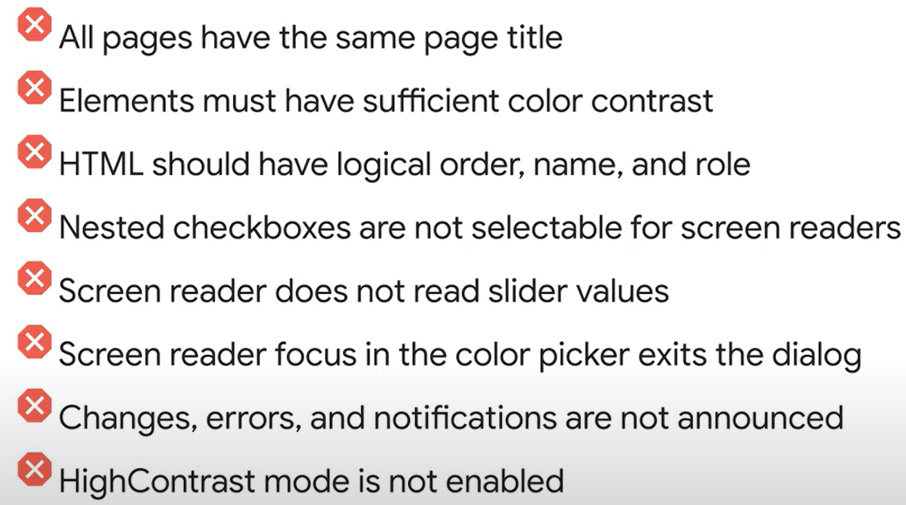

# Build more accessible apps in 
https://www.youtube.com/watch?v=Gm_bD1abFXI&list=PLNYkxOF6rcIDKuCU73tmdRN_-mI3tKFPD&index=6

https://codelabs.developers.google.com/angular-a11y#0

https://github.com/googlecodelabs/angular-accessibility

Web content Accessibility Guidelines (WCAG) 2.0

## Manually testing accessibility
Turn computer build-in screen reader and navigating through the app with keyboard navigation.
https://web.dev/semantics-and-screen-readers/


Use chrome inspect -> lighthouse -> check Accessibility, Desktop -> generate report


Use eslint
```
ng lint
```
.eslintrc.json
0 = off, 1 = warning, 2 = error
```
"rules": {
"@angular-eslint/template/accessibility-alt-text": 2,
"Gangular-eslint/template/accessibility-elements-content": 2,
"@angular-eslint/template/accessibility-label-for": 2,
"@angular-eslint/template/no-positive-tabindex": 2,
"Gangular-eslint/template/accessibility-table-scope": 2,
"@angular-eslint/template/accessibility-valid-aria": 2,
"@angular-eslint/template/click-events-have-key-events";2,
"@angular-eslint/template/mouse-events-have-key-events";2,
"@angular-eslint/template/no-autofocus": 2,
"@angular-eslint/template/no-distracting-elements";2
}
```

## Fix errors
Define unique page title
title is added in Angular v14
```
src/app/app-routing.module.ts
const routes: Routes = [
  { path: 'shop', component: ShopComponent, title: 'Our Shop – a11y in Angular' },
  { path: 'about', component: AboutComponent, title: 'Our Story - a11y in Angular' },
  { path: 'locate', component: LocationComponent, title: 'Find Us - a11y in Angular' },
  { path: '',   redirectTo: '/shop', pathMatch: 'full' },
  { path: '**', component: ShopComponent },
];

```

Fix Color contrast ratio
```
// TODO: #5. Ensure adequate color contrast
$light-primary: mat.define-palette(mat.$pink-palette, $default: A100, $lighter: 100, $text: 900);
$light-accent: mat.define-palette(mat.$red-palette, $default: A400, $lighter: 100);
```
Use chrome inspect -> inspect element -> styles -> color contrast
or
Use chrome inspect -> lighthouse -> check Accessibility, Desktop -> generate report -> contrast


Using semantic HTML
semantic HTML ensure that screen reader in keyboard navigation can understand the interactions and control the HTML
