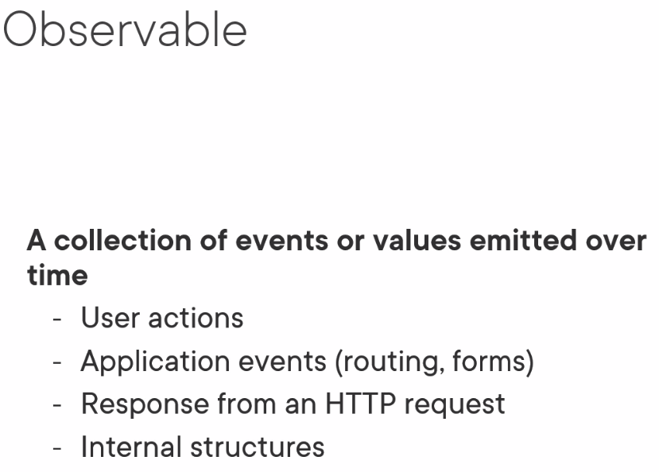
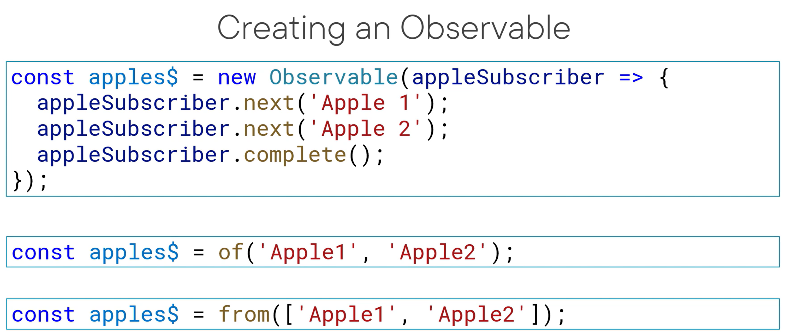

## Observable (可观察对象)
data or event (array, DOM event, HTTP requests, timers) generator 表示一个概念，这个概念是一个可调用的未来值或事件的集合。

A collection of events or values emitted over time, like User actions, application events, http response.

It connects an observer to a source of data or events





Create a Observable
```
import {subject} from 'rxjs';

const source$ = new Subject();

// Notify
source$.next(1);

```

## Observer (观察者)  
Observer is an object that observes and responses to notification. 

Observer is a object that has 3 methods:
```
const observer = {
    next: (data) =› console. log(data),
    error: (err) =› console. log(err),
    complete: () =› console. log('complete')
};
```

Observer is used to subscribe the notification from Observable.
```
    observable.subscribe(observer);
```

Only process the next notification
```
    observable.subscribe({
        next: data => console.log(data)
    });
```
or pass in a function, it will be used as next method
```
    observable.subscribe(data => console.log(data));
```

```
- Subscriber: One class implements the Observer interface. A subscriber is basically an observer with additional features to unsubscribe from an observable.

- Subscription (订阅):  connects observer with observable. 表示 Observable 的执行，主要用于取消 Observable 的执行。 

- Operators (操作符):  采用函数式编程风格的纯函数 (pure function)，使用像 map、filter、concat、flatMap 等这样的操作符来处理集合。


- Schedulers (调度器):  用来控制并发并且是中央集权的调度员，允许我们在发生计算时进行协调，例如 setTimeout 或 requestAnimationFrame 或其他。
