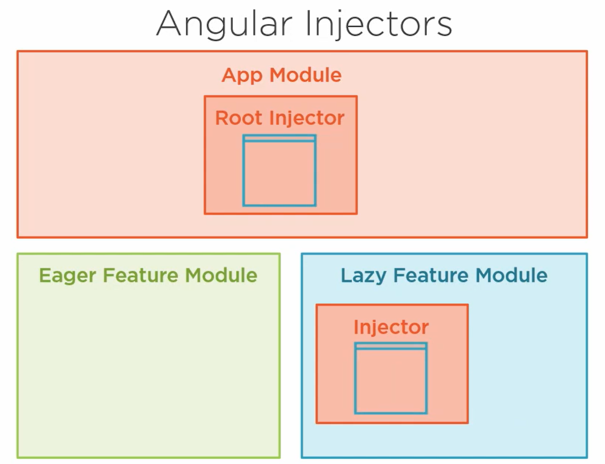

For every Angular app, Angular creates a root injector, which is responsible for injecting services wherever they're needed

Angular actually registers the service in the eager-loaded module with the root injector. This makes it available to the entire app.

If you provide a service in a lazily-loaded feature module, Angular creates a new injector for that module and registers it there.This instance of the service is now only available to this module.


 If I provided the user-repository service in the eagerly-loaded feature module, and then provided it again in the lazily-loaded feature module, Angular would create two different instances of the service. 


## Core module
If you need a single instance of a service to be available everywhere, define it in your core module,

This is place to put services that we want to be shared throughout our app without cluttering up the app module.

This is a module that we know will never be lazily loaded, and provide a service in this module, it gets registered in our root injector, so it becomes a `singleton service` that is available to our entire app.

```ts
@NgModule({
  providers: [UserRepositoryService]
})
```
