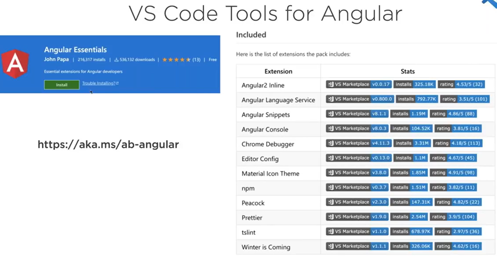

# Angular Patterns & Best Practices

by John Papa

https://app.pluralsight.com/library/courses/angular-patterns-best-practices-webinar/table-of-contents

## VS Code Tolling for angular



## RxJS

```
  npm install subsink
```

3. NgRx
4. Preloading strategies
5. API strategies
6. Angular Debugging
