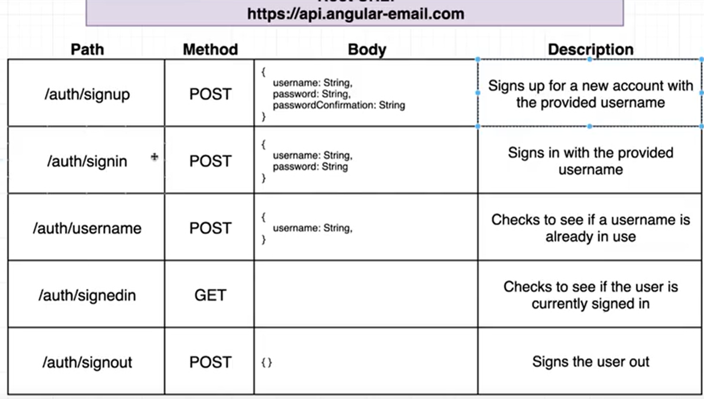
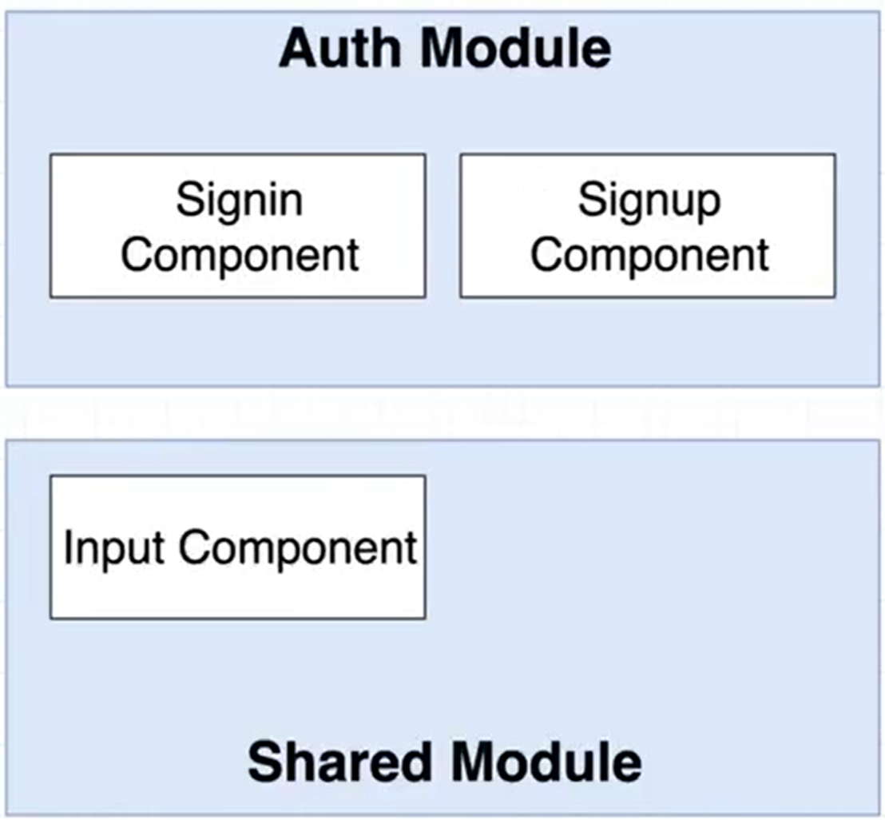
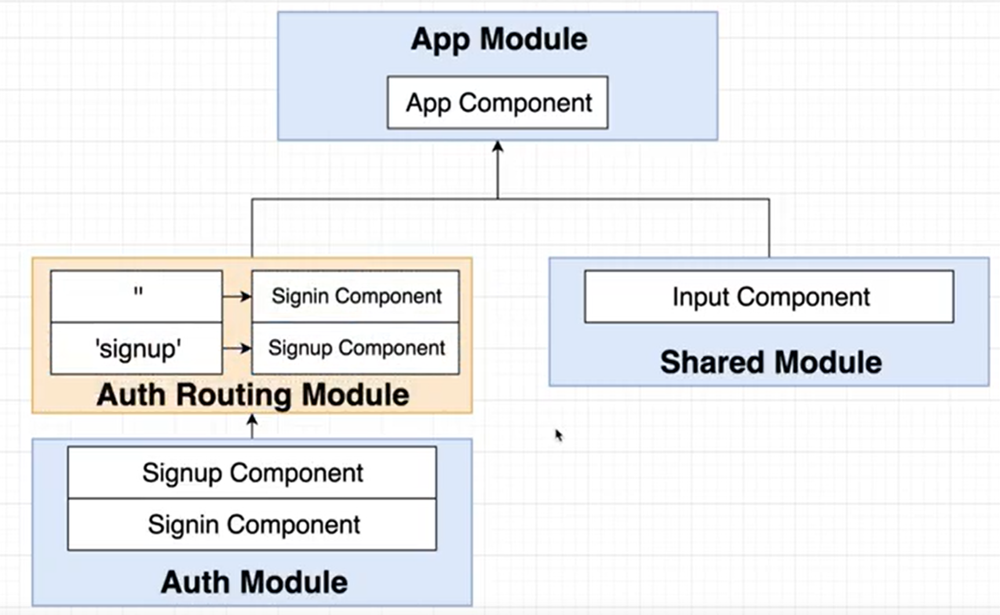

## Features
- Authentication system: sign in, sign up, sign out
- Email client: Compose, show email list, show email detail


## Create new project
```
  ng new emailclient
```

## API server



## Create module

```
  ng g m Auth --routing
  ng g m Shared

  ng g c auth/Signin
  ng g c auth/Signup

  ng g c shared/Input
```



## Signup


## Style
```
  npm i semantic-ui-css
```
Modify style.css
```
  @import 'semantic-ui-css/semantic.css'
```


## Validation
```
@Component({
  selector: 'app-signup',
  templateUrl: './signup.component.html',
  styleUrls: ['./signup.component.css']
})
export class SignupComponent {
  authForm = new FormGroup({
    username: new FormControl('', [Validators.required, Validators.email]),
    password: new FormControl('', [Validators.required, Validators.minLength(4)]),
    passwordConfirmation: new FormControl('', [Validators.required, Validators.minLength(4)])
  })
}
```

Test
```
  {{authForm.get('username').errors | json}}
```

## Custom Validation
Class-Based Custom Sync Validator
1. Create a new class to implement your custom validator
2. [Optional] Have the class implement the 'Validator' interface
3. Add a 'validate' method to the class, which will be called with a FormGroup or FormControl
4. Validator method should return 'null' if everything is OK, or an object if something is wrong

```
  ng g class auth/validators/MatchPassword

  ng g class auth/validators/UniqueUsername
```


## Create Auth Service
```
  ng g service auth/Auth
```


## Reusable Input Component
```
  ng g c shared/Input
```
export InputComponent in shared.module.ts
import ReactiveFormsModule in shared.module.ts

import SharedModule in auth.module.ts

use InputComponent in signup.component.html
```html
  <app-input label="Username" [control]="authForm.get('username')" inputType="text"></app-input>
```

Error handling
```html
<div *ngIf="showErrors()" class="ui pointing red basic label">
      <p *ngIf="control.errors?.['required']">
          Value is required`
      </p>
</div>
```

## Nav Header


## Auth routing
app-routing.module.ts
```ts
const routes: Routes = [
  { path: 'signout', component: SignoutComponent },
  {
    path: 'signup', component: SignupComponent
  },
  { path: '', component: SigninComponent }
];
```

## Auth status
Requirements of the Signedin Observable
- We must be able to get it to emit a new value 'from the outside'
- We must be able to give it a default, or starting, value
- New subscribers must be given the value from it immediately after subscribing

```
  BehaviorSubject<boolean>
```

## AuthHttpInterceptor
```
  ng g class auth/AuthHttpInterceptor
```

## Sign out
```
  ng g c auth/Signout
```


## Sign in
```
  ng g c auth/Signin
```


## inbox module
